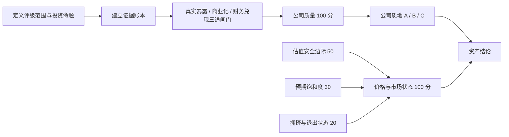

# AStock ABC Classifier

一套面向 A 股产业链研究的、证据驱动的公司质地分层 Skill。

它解决一个经常被混淆的问题：

> **好公司不等于好资产；好公司 + 好价格，才可能构成好资产。**

`astock-abc-classifier` 先在不使用当前股价、估值和交易拥挤度的前提下，把公司分为 A/B/C；再单独评估估值、预期饱和度、交易拥挤和退出风险，形成当前资产结论。

适用于光模块、PCB、CCL、MLCC、AI 芯片、半导体设备、半导体材料、周期资源品、项目制造、软件与 AI 应用等股票池，也可以扩展到其他存在清晰“产业—产品—客户—订单—财务”链条的行业。

## 为什么需要它

产业投资中常见四类误判：

1. 把行业景气当成公司一定受益；
2. 把产品发布、送样或认证当成订单和利润；
3. 因为股价便宜，就把弱公司升级；
4. 因为股价上涨或交易拥挤，就把好公司降级。

本 Skill 用两套彼此隔离的判断修正这些问题：

- **公司质地层**：回答“公司在指定投资命题下是否形成基本面闭环”；
- **价格与市场层**：回答“当前估值和交易结构是否提供足够赔率”。



## 核心原则

### 1. ABC 只判断公司，不判断股价

- **A：高质量公司**——产业、业务、订单、业绩、壁垒和持续性形成较强闭环；
- **B：公司层面仍待验证**——产业或业务真实，但商业化、盈利质量、竞争格局或持续性仍有明显缺口；
- **C：故事或弱兑现**——目标业务暴露弱，仍停留在规划、送样或少量收入阶段，或增长主要依赖题材和不可持续因素。

股价上涨、下跌、估值高低和交易拥挤不会直接改变公司 ABC。只有产业、业务、订单、财务、壁垒、持续性或治理发生变化，才能触发升级或降级。

### 2. ABC 必须绑定评级范围

ABC 不是脱离上下文的永久标签。

例如，一家公司整体经营质量可能是 A，但 AI 芯片业务只贡献极少收入，那么它可以被写成：

> 整体公司 A；AI 芯片主题受益 B 或 C。

因此，每次评级都先写清楚：

- 评价整体公司，还是某个产业主题下的受益质量；
- 观察窗口和待验证的投资命题；
- 哪一部分收入、利润和增量利润属于目标业务。

### 3. 分数不能绕过硬闸门

总分高不代表一定是 A。若真实暴露、规模商业化或财务真实性不成立，其他维度的高分不能补偿。

判定优先级为：

1. 先执行 C 类否决；
2. 再检查 A 类全部硬门槛；
3. 未触发否决但没有完全闭环的真实业务归 B；
4. 总分低于 60 归 C。

### 4. 缺失就是未知，不是零，也不是中性

- 不因为缺少数据而给低分；
- 也不因为无法验证而假设通过；
- 数据覆盖不足时输出区间、问号评级或低置信度；
- 低置信度公司最高只能暂评 B。

## 运行机制

### 第一步：建立证据账本

证据按可靠性分为五级：

| 等级 | 典型来源 | 用法 |
|---|---|---|
| S | 财报、公告、交易所或监管文件、正式合同 | 核心事实 |
| A | 投资者关系记录、客户资料、可独立验证数据 | 交叉验证 |
| B | 产业数据库、招投标、价格、库存、开工和协会数据 | 验证产业链 |
| C | 券商研报、专家纪要、财经媒体 | 建立假设 |
| D | 论坛、群聊、社交媒体、未署名消息 | 只作线索，不计分 |

A 类关键结论至少需要两项独立的 S/A 级证据。公司自述只能证明“公司说过”，不能单独证明客户采用、市场份额或未来订单。

### 第二步：通过三道公司闸门

| 闸门 | 核心问题 | 典型失败信号 |
|---|---|---|
| G1 真实暴露 | 目标业务是否真正贡献收入、利润或主要增量 | 只有研发、规划、参股、合作意向 |
| G2 商业化 | 是否从产品和认证走到连续交付与复购 | 只有样品、实验室指标、框架协议 |
| G3 财务兑现 | 收入、利润、现金、应收、存货是否互相印证 | 非经常损益支撑利润，现金和营运资金持续异常 |

G1 或 G2 失败通常归 C；部分通过最高为 B。G3 阶段性错配且可解释时最高为 B，重大真实性或持续经营疑点归 C 或放弃。

### 第三步：计算公司质量分

公司质量总分为 100 分，完全排除当前股票价格和交易数据。

| 维度 | 权重 | 主要观察内容 |
|---|---:|---|
| D1 产业需求与方向 | 10 | 终端需求、渗透率、价值量、库存、资本开支 |
| D2 真实业务暴露 | 10 | 收入、毛利、增量利润和资本投入中的地位 |
| D3 商业化、客户与订单 | 20 | 认证、量产、交付、复购、客户质量、收入可见度 |
| D4 财务兑现与质量 | 20 | 主营增长、扣非利润、现金流、应收、存货、单位盈利 |
| D5 竞争壁垒与龙头性 | 20 | 技术、良率、成本、认证、份额、生态和议价能力 |
| D6 持续性与产业周期 | 15 | 未来 6—18 个月可见度、供给、替代路线和周期位置 |
| D7 治理与资产负债表 | 5 | 大股东行为、关联交易、负债、担保、诉讼和披露质量 |

每个维度先给 0—5 原始分，再按权重折算：

```text
维度得分 = 原始分 / 5 × 维度权重
```

产品价格、行业 ASP、原材料成本和库存周期属于公司基本面，可以进入 D1、D4 或 D6；股票价格、PE/PB 和持仓拥挤不能进入公司质量分。

### 第四步：判定公司 ABC

#### A 类

必须同时满足：

- 公司质量分不低于 80；
- D2 ≥ 7/10、D3 ≥ 14/20、D4 ≥ 14/20、D5 ≥ 14/20、D6 ≥ 9/15；
- G1、G2、G3 全部通过；
- 置信度至少为中；
- 无重大否决项。

#### B 类

典型情形包括：

- `60 ≤ 公司质量分 < 80`；
- 总分达到 80，但任一 A 类硬门槛未满足；
- 三道闸门只有部分通过；
- 产业和业务真实，但订单、财务、壁垒或持续性尚未闭环。

#### C 类

典型情形包括：

- 公司质量分低于 60；
- G1 或 G2 失败；
- 目标业务仍停留在规划、送样、概念或不可验证阶段；
- 增长主要依赖非经常损益、题材或不可持续交易；
- 存在重大财务真实性、治理或持续经营风险。

## 价格与市场状态

只有当用户要求当前可投资性、估值、追高风险、择时或仓位判断时，才启动这一层。若只要求公司 ABC，则明确写“当前价格未评估”，不为填满模板猜测市场数据。

| 模块 | 权重 | 回答的问题 |
|---|---:|---|
| M1 估值安全边际 | 50 | 当前市值隐含悲观、基准还是乐观情景 |
| M2 预期饱和度 | 30 | 股价是否已经交易了大部分业绩和催化 |
| M3 拥挤与退出状态 | 20 | 持仓、杠杆和流动性是否使退出结构脆弱 |

不同商业模式使用不同估值方法：稳定盈利看 PE、PEG、FCF 和 ROIC；周期和重资产看 PB、EV/EBITDA、单位产能价值与中周期利润；早期成长看 EV/S、EV/毛利及可验证的盈利路径；多业务公司使用分部估值。

周期公司不能用景气顶部利润制造“低 PE＝便宜”的假象。

## 交易拥挤度

拥挤风险分为 0—100，越高风险越大。它衡量交易结构，不证明公司好坏，也不单独预测涨跌。

| 子维度 | 权重 | 典型指标 |
|---|---:|---|
| C1 量价交易热度 | 30 | 换手、换手加速度、相对涨幅、波动和异常交易 |
| C2 机构持仓集中 | 30 | 公募持股、重仓基金数量、持仓变化和重合度 |
| C3 杠杆资金 | 25 | 融资余额占比、融资增速、融资买入强度和背离 |
| C4 退出流动性 | 15 | 退出天数、成交深度、解禁减持和新增卖盘 |

拥挤风险反向进入价格与市场状态：

```text
M3 = 20 × (100 - 拥挤风险分) / 100
```

分层采用连续边界：

- `0—30`：低拥挤；
- `>30—55`：中等拥挤；
- `>55—75`：高拥挤；
- `>75—100`：极度拥挤。

基本面和盈利预测只用于区分“拥挤但健康”与“拥挤且脆弱”，不进入纯交易拥挤分。公募季报持仓必须注明披露滞后，不能写成实时仓位。

## 从好公司到好资产

| 公司等级 | 价格与市场状态 | 资产结论 |
|---|---|---|
| A | ≥75，拥挤风险≤75，关键数据置信度至少为中 | 好资产候选 |
| A | 60—<75 | 好公司 + 合理价格 |
| A | 40—<60 | 好公司，但价格一般或偏贵 |
| A | <40 | 好公司，但价格差 |
| B | 任意 | 待验证公司，低价不能替代基本面验证 |
| C | 任意 | 非核心公司，低价不能升级 |

极度拥挤是一项资产结论硬约束：即使综合分被较高的估值安全边际推到 75 以上，也不能称为“好价格/好交易结构”或“好资产”，应写成：

> A 公司，估值可能有吸引力，但交易结构极度拥挤。

## 行业适配

通用权重和 ABC 硬门槛保持不变，只替换行业 KPI、商业化里程碑和关键反证。

| 行业 | 重点验证 |
|---|---|
| 光模块与高速互联 | 速率代际、认证、出货、良率、功耗、ASP 年降 |
| PCB / CCL / 电子材料 | 高端规格、单位价值、良率、高端产能利用率、材料认证 |
| MLCC | 高端规格结构、稼动率、渠道库存、价格和单位盈利 |
| AI 芯片 | 流片到量产、软件生态、客户部署、复购、良率和回款 |
| 半导体设备 | 验证、重复订单、验收、合同负债、发出商品和客户份额 |
| 半导体材料 | 送样、批次导入、稳定供货、高端占比和单位利润 |
| 周期资源品 | 成本曲线、库存、供给投放、中周期利润和自由现金流 |
| 项目制造 | 招标、合同、生效、交付、验收、回款和订单取消条款 |
| 软件与 AI 应用 | 付费、留存、复购、使用量、单位经济性和现金消耗 |

## 标准工作流

1. 明确股票池、评级范围、观察时点和投资命题；
2. 建立公司事实卡，确认真实利润来源；
3. 建立带日期和证据等级的证据账本；
4. 依次检查 G1、G2、G3；
5. 选择匹配商业模式的行业适配器；
6. 计算七维公司质量分并判定 ABC；
7. 在需要时另算估值、预期和拥挤；
8. 组合公司等级与价格状态，形成资产结论；
9. 主动寻找最强反证和最脆弱假设；
10. 给出升级、降级、放弃和价格改善的可验证触发器。

## 输出内容

单公司研究默认包含：

- 评级范围和投资命题；
- 公司 ABC、公司质量分和置信度；
- 固定 ABC 图例；
- 三道闸门状态与七维评分；
- 最硬证据、最大缺口和最强反证；
- 下一报告期验证点；
- 公司升级、降级和放弃条件；
- 若触发当前可投资性分析，再增加估值、预期、拥挤和资产结论。

股票池研究同时给出“公司质量排名”和“当前资产吸引力排名”，不因价格便宜把 B/C 公司排成更好的公司。

## 使用示例

```text
使用 $astock-abc-classifier，按 2026-08-01 可得公开信息，
分析这组光模块股票在 800G/1.6T 投资命题下的公司质地 ABC。
先不要看估值，只比较真实暴露、客户订单、财务兑现、壁垒和持续性。
```

```text
使用 $astock-abc-classifier，在公司 ABC 不变的前提下，
补充估值安全边际、预期饱和度和交易拥挤度，
判断哪些 A 公司当前可以称为好资产候选。
```

```text
使用 $astock-abc-classifier，比较一家公司的整体质量评级，
以及它在 AI 芯片主题下的受益评级；如果两者不同，请并列展示。
```

## 建议的仓库结构

```text
.
├─ README.md
└─ skill/
   └─ astock-abc-classifier/
      ├─ SKILL.md
      ├─ agents/
      │  └─ openai.yaml
      └─ references/
         ├─ core-framework.md
         ├─ crowding-analysis.md
         ├─ industry-adapters.md
         └─ output-templates.md
```

实际安装时，将 `astock-abc-classifier` 技能目录放入 Codex 的 skills 目录。在 Windows 默认环境中通常为：

```text
C:\Users\<用户名>\.codex\skills\astock-abc-classifier
```

## 设计纪律

- 不把“有产品”写成“已量产”；
- 不把“认证”写成“订单”；
- 不把“订单”写成“利润”；
- 不把“扩产”写成“需求已兑现”；
- 不用行业景气替代公司份额；
- 不重复奖励同一条证据链；
- 不把基金季报持仓写成实时持仓；
- 不制造伪精确分数；
- 不承诺收益，不把拥挤度写成确定涨跌预测。

## 已验证的不变量

当前版本已通过以下逻辑检查：

- 公司质量权重与拥挤权重分别严格合计为 100；
- A/B/C 和市场状态的小数边界连续，无 30.5、55.5、74.5 等空档；
- 改变股价、估值和拥挤输入不会改变公司 ABC；
- B/C 公司不会因为价格便宜或低拥挤被判成好资产；
- 总分高但关键闸门失败时不能评 A；
- 极度拥挤不能被较高估值分掩盖；
- 估值或拥挤数据缺失时不会输出伪精确的好资产结论；
- 跨光模块、PCB、MLCC、AI 芯片、周期品等不同商业模式时，核心权重与否决规则保持一致。

## 边界与限制

这是研究和证据组织框架，不是自动买卖系统，也不保证数据源完整或结论永久有效。

公司评级会随订单、财报、客户、竞争格局、产业周期和治理证据变化；价格与拥挤结论的有效期通常更短。任何输出都应标明观察日期、数据日期、关键未知和下一验证点。

